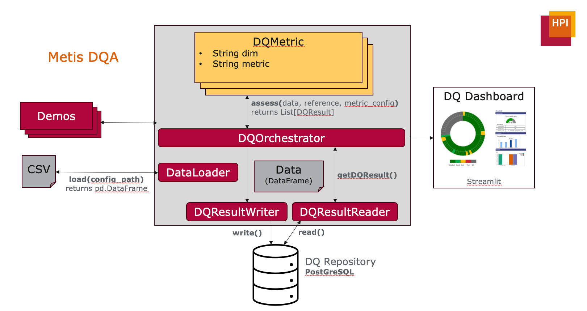

# Metis

Metis is a framework to automatically assess the quality of tabular data across multiple data quality dimensions. The Metis DQ framework (this GitHub repo) is part of the Metis project: [www.metisdq.org](www.metisdq.org)



## Start the demo and run Metis:
```
python -m demo.getting_started
```

## How to implement new metrics

To extend the Metis framework and add new data quality metrics, please check our interface for easy integration. 
````python
def assess(self, 
            data: pd.DataFrame, 
            reference: Union[pd.DataFrame, None] = None, 
            metric_config: Union[str, None] = None) -> List[DQResult]:
````
Each metric should be a subclass of ```metis.metric.metric.Metric``` and implement the assess method. This method takes three arguments:
- **data: pandas.Dataframe**: The DataFrame that should be assessed by this metric. This is the primary dataset under inspection.
- **reference: Optional[pd.DataFrame]**: An optional, cleaned reference DataFrame that can act as a gold-standard / ground-truth version of the dataset. Metrics that need a clean version of the data (e.g., correctness against a known-good source) should accept and use this DataFrame. If not needed by a metric, `None` is allowed.
- **metric_config: Optional[str]**: Optional path or JSON string containing metric-specific configuration. Use this to keep the method signature compact; all metric-specific parameters (thresholds, aggregation options, etc.) can be stored here.

The metric should return a list of ```metis.utils.result.DQResult```. This can be only one object if one value is computed on a table level or mutliple DQResults if for example one result per column is computed.

## Output: creating a DQResult

````python
class DQResult:
    def __init__(
        self,
        mesTime: pd.Timestamp,
        DQvalue: float,
        DQdimension: str,
        DQmetric: str,
        columnNames: Union[List[str], None] = None,
        rowIndex: Union[int, None] = None,
        DQannotations: Union[dict, None] = None,
        dataset: Union[str, None] = None,
        tableName: Union[str, None] = None,
    ):
````

To create a new instance of DQResult, one needs to provide at least the following arguments:
- **mesTime: pd.Timestamp**: The time at which a result was assessed.
- **DQvalue: float**: The result of the assessment. This currently only supports quantitative assessments.
- **DQdimension: str**: The name of the data quality dimension that was assessed e.g. completeness, accuracy, etc.
- **DQmetric: str**: The name of the specific metric inside the given dimension that was assessed.

Furthermore, there are more optional arguments that might need to be set depending on the nature of different metrics. ```dataset``` and ```tableName``` are automatically set by the ```metis.dq_orchestrator.DQOrchestrator``` class which controles the data quality assessment and takes care of calling the individual metrics and storing the results.
- **columnNames: Optional[List[str]]**: List of column names associated with the assessed result. For example for column level completeness, this would be a list with a single column name, for table level completeness this would be empty since the result is valid for the whole table.
- **rowIndex: Optional[int]**: Index of the row this result is associated with. This can either be used together with columnNames to assess data quality on a cell level or for row based metrics.
- **DQannotations: Optional[dict]**: To allow metrics to save additional information or annotations, this dictionary can store all additional information that might need to be saved. This currently does not need for follow a predefined structure.


