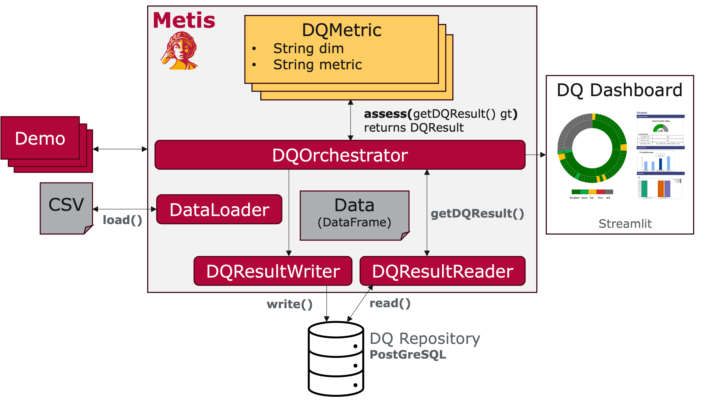

# Metis

Metis is a framework to automatically assess the quality of tabular data across multiple data quality dimensions. The Metis DQ framework (this GitHub repo) is part of the Metis project: [www.metisdq.org](https://www.metisdq.org)



## Start the demo and run Metis:
```
python -m demo.getting_started
```

## Full demo (all metrics)

To run every registered metric against the full TripAdvisor European Restaurants dataset, use the extended demo. **Note: this will take some time.**

```
python -m demo.run_demo
```

The demo uses `data/restaurants.csv`, the full
[TripAdvisor European Restaurants dataset from Kaggle](https://www.kaggle.com/datasets/stefanoleone992/tripadvisor-european-restaurants)
(~1.08 M rows). The CSV includes 42 original columns (ratings, cuisines,
location, price level, …) plus two synthetic timestamp columns
(`first_review_date` and `last_review_date`) with ~10 % intentional nulls
to surface interesting completeness findings.

## How to implement new metrics

To extend the Metis framework and add new data quality metrics, please check our interface for easy integration.
````python
def assess(self,
            data: pd.DataFrame,
            reference: Union[pd.DataFrame, None] = None,
            metric_config: Union[str, None] = None) -> List[DQResult]:
````
Each metric should be a subclass of ```metis.metric.metric.Metric``` and implement the assess method. This method takes three arguments:
- **data: pandas.Dataframe**: The DataFrame that should be assessed by this metric. This is the primary dataset under inspection.
- **reference: Optional[pd.DataFrame]**: An optional, cleaned reference DataFrame that can act as a gold-standard / ground-truth version of the dataset. Metrics that need a clean version of the data (e.g., correctness against a known-good source) should accept and use this DataFrame. If not needed by a metric, `None` is allowed.
- **metric_config: Optional[str]**: Optional path or JSON string containing metric-specific configuration. Use this to keep the method signature compact; all metric-specific parameters (thresholds, aggregation options, etc.) can be stored here.

The metric should return a list of ```metis.utils.result.DQResult```. This can be only one object if one value is computed on a table level or mutliple DQResults if for example one result per column is computed.

**Note:** Each metric has to be imported in the *__init__.py* file inside the folder *metric/* so it is recognized by the Metric registry.

### Metric naming convention

Metrics are organized by dimension (e.g., `completeness`, `minimality`), where one folder exists for each.
New metrics should follow the naming format: `{DimensionName}_{Technique}`

- **DimensionName**: The quality dimension being measured (e.g., `Completeness`, `Minimality`)
- **Technique**: The calculation or method used (e.g., `NullRatio`, `DuplicateCount`)

Examples: `completeness_nullRatio`, `minimality_duplicateCount`

The file name and class name of each metric should be equal. If a metric has a specific config class, the name of the config class should be `{MetricName}_config` (e.g., `completeness_missingRatio_config`).

- **Granularity**: The level of analysis (e.g., `cell`, `row`, `column`, `table`) should be passed as a parameter through the metric config file if the metric can be applied at different granularity levels.

### Config conventions

These conventions are required for a metric to be picked up correctly by the
GUI catalog (`gui/core/metric_catalog.py`) and rendered with the right
editor and badges.

#### Config file and class

- Config file lives in the same package as its metric and is named
  `{MetricName}_config.py`.
- The config class name equals the file stem (e.g.
  `completeness_nullRatio_config`).
- The class inherits from `metis.metric.config.MetricConfig` (a dataclass
  with a `validate()` hook) and is itself a `@dataclass`.
- Every field should have a default so the GUI can render the metric
  without forcing the user to fill anything in. Use the `aggregation_axis`
  + `aggregate_all` pattern for metrics that can be summarized at multiple
  granularities:

  ```python
  @dataclass
  class completeness_nullRatio_config(MetricConfig):
      aggregation_axis: Literal["index", "columns", None] = None
      aggregate_all: bool = False
  ```

#### Three config types

The GUI dispatches to one of three editors based on metadata declared on
the metric class:

| Type             | Marker on metric class                  | Editor                          |
|------------------|-----------------------------------------|---------------------------------|
| Dataclass config | (default — just provide a config class) | `simple_editor`                 |
| Callable rules   | `_gui_callable_config = True`           | `callable_editor` (Python rules)|
| FD JSON config   | `name == "consistency_countFDViolations"` (handled specially) | inline FD-rule editor |

`timeliness_heinrich` uses a dedicated `timeliness_editor` (selected by
metric name) because its config nests per-column settings.

#### GUI metadata class attributes

Declare these as class attributes on the `Metric` subclass. All are
optional and default to safe values; see existing metrics for examples.

| Attribute                        | Type           | Purpose                                                                                          |
|----------------------------------|----------------|--------------------------------------------------------------------------------------------------|
| `_gui_description`               | `str`          | Short summary of how the metric is calculated. Shown under the metric name in the GUI.           |
| `_gui_requires_reference`        | `bool`         | The metric needs a reference DataFrame (e.g. `correctness_heinrich`).                            |
| `_gui_config_required`           | `bool`         | The metric refuses to run without a config; the GUI blocks **Compute** until one is provided.    |
| `_gui_callable_config`           | `bool`         | The config carries Python callables (rules) and must be edited via the callable editor.          |
| `_gui_cell_granularity`          | `bool`         | The metric *can* emit per-cell results, so the GUI offers a row-limit cap.                       |
| `_gui_recommended_granularities` | `frozenset[DQGranularity]` | Granularities the metric produces meaningful results at. Used by the results page renderers. |

#### Native dependency declarations

Metrics that depend on a native library (e.g. FAHES) must register a check
in `_NATIVE_LIB_CHECKS` in `gui/core/metric_catalog.py`. The catalog will
mark the metric as unavailable when the library is missing, the GUI will
disable its checkbox with a warning, the per-dimension/global "Select all"
buttons will skip it, and `get_compute_blockers` will refuse to run it.

## Output: creating a DQResult

````python
class DQResult:
    def __init__(
        self,
        timestamp: pd.Timestamp,
        DQdimension: DQDimension,
        DQmetric: str,
        DQgranularity: str,
        DQvalue: float,
        DQexplanation: Union[dict, None] = None,
        runtime: Union[float, None] = None,
        tableName: Union[str, None] = None,
        columnNames: Union[List[str], None] = None,
        rowIndex: Union[int, None] = None,
        experimentTag: Union[str, None] = None,
        dataset: Union[str, None] = None,
        configJson: Union[dict, None] = None,
    ):
````

To create a new instance of DQResult, one needs to provide at least the following arguments:
- **timestamp: pd.Timestamp**: The time at which a result was assessed.
- **DQdimension: DQDimension**: Data quality dimension assessed (e.g. `DQDimension.COMPLETENESS`, `DQDimension.ACCURACY`).
- **DQmetric: str**: Name of the specific metric within the dimension.
- **DQgranularity: str**: Granularity of the metric (e.g. 'column', 'table', 'cell', 'row').
- **DQvalue: float**: Numeric outcome of the assessment. This currently only supports quantitative assessments.

Furthermore, there are more optional arguments that might need to be set depending on the nature of different metrics. ```dataset``` and ```tableName``` are automatically set by the ```metis.dq_orchestrator.DQOrchestrator``` class which controls the data quality assessment and takes care of calling the individual metrics and storing the results.
- **DQexplanation: Optional[dict]**: Arbitrary additional information produced by the metric (no fixed schema required).
- **runtime: Optional[float]**: Time taken to compute the metric, in seconds.
- **columnNames: Optional[List[str]]**: Columns that this result pertains to. For a column-level metric this is typically a single-item list; for a table-level metric this may be `None` or an empty list.
- **rowIndex: Optional[int]**: Row index associated with the result. Use together with `columnNames` to represent a cell-level result, or for row-based metrics.
- **experimentTag: Optional[str]**: Tag to identify a specific run.
- **configJson: Optional[dict]**: Configuration used for the metric as a JSON object.

## Data Profiling

Metis includes a data profiling system that caches computed statistics and supports importing pre-computed profiles.

### Cached Profiling Functions

Use cached profiling functions from `metis.profiling` for automatic caching:

```python
from metis.profiling import null_count, distinct_count, data_type

# These are automatically cached when DataProfileManager is initialized
nulls = null_count(df["column"])
```

### Importing Pre-computed Profiles

You can import pre-computed data profiles (from external tools like HyFD, CFDFinder, etc.) via the data loader config:

```json
{
  "loader": "CSV",
  "name": "Adult",
  "file_name": "adult.csv",
  "data_profiles": {
    "fd": {
      "source": "hyfd",
      "file": "outputs/adult_hyfd.txt"
    },
    "null_count": {
      "source": "manual",
      "values": [
        {"column": "age", "value": 0},
        {"column": "workclass", "value": 1836}
      ]
    }
  }
}
```

For complete documentation of all supported import formats, see [Data Profile Import Formats](docs/DATA_PROFILE_IMPORT_FORMATS.md).

### Cache Control Flags

Three flags can be passed to `DataProfileManager.initialize()`:

- **`ignore_cache`**: Never read from or write to the database. Pure passthrough on every call.
- **`overwrite_cache`**: Skip cache lookup; always recompute and overwrite the stored value. Note: every call recomputes, not just the first. There is no within-run caching.
- **`clear_cache`**: Delete all stored profiles at startup, then cache normally from there.

```python
DataProfileManager.initialize(engine, ignore_cache=True)    # passthrough, DB untouched
DataProfileManager.initialize(engine, overwrite_cache=True) # always recompute and overwrite
DataProfileManager.initialize(engine, clear_cache=True)     # wipe table at startup, then cache normally
```

