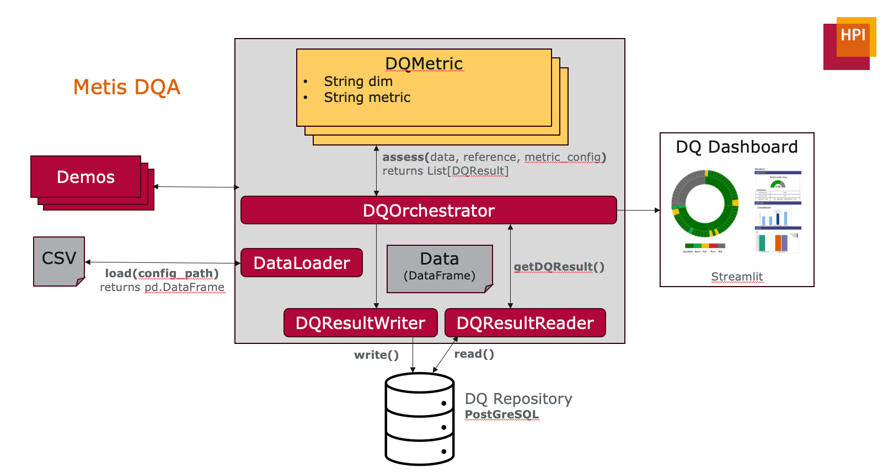

# Metis

Metis is a framework to automatically assess the quality of tabular data across multiple data quality dimensions. The Metis DQ framework (this GitHub repo) is part of the Metis project: [www.metisdq.org](https://www.metisdq.org)



## Start the demo and run Metis:
```
python -m demo.getting_started
```

## How to implement new metrics

To extend the Metis framework and add new data quality metrics, please check our interface for easy integration.
````python
def assess(self,
            data: pd.DataFrame,
            reference: Union[pd.DataFrame, None] = None,
            metric_config: Union[str, None] = None) -> List[DQResult]:
````
Each metric should be a subclass of ```metis.metric.metric.Metric``` and implement the assess method. This method takes three arguments:
- **data: pandas.Dataframe**: The DataFrame that should be assessed by this metric. This is the primary dataset under inspection.
- **reference: Optional[pd.DataFrame]**: An optional, cleaned reference DataFrame that can act as a gold-standard / ground-truth version of the dataset. Metrics that need a clean version of the data (e.g., correctness against a known-good source) should accept and use this DataFrame. If not needed by a metric, `None` is allowed.
- **metric_config: Optional[str]**: Optional path or JSON string containing metric-specific configuration. Use this to keep the method signature compact; all metric-specific parameters (thresholds, aggregation options, etc.) can be stored here.

The metric should return a list of ```metis.utils.result.DQResult```. This can be only one object if one value is computed on a table level or mutliple DQResults if for example one result per column is computed.

**Note:** Each metric has to be imported in the *__init__.py* file inside the folder *metric/* so it is recognized by the Metric registry.

### Metric naming convention

Metrics are organized by dimension (e.g., `completeness`, `minimality`), where one folder exists for each.
New metrics should follow the naming format: `{DimensionName}_{Technique}`

- **DimensionName**: The quality dimension being measured (e.g., `Completeness`, `Minimality`)
- **Technique**: The calculation or method used (e.g., `NullRatio`, `DuplicateCount`)

Examples: `completeness_nullRatio`, `minimality_duplicateCount`

The file name and class name of each metric should be equal. If a metric has a specific config class, the name of the config class should be `{MetricName}_config` (e.g., `completeness_missingRatio_config`).

- **Granularity**: The level of analysis (e.g., `cell`, `row`, `column`, `table`) should be passed as a parameter through the metric config file if the metric can be applied at different granularity levels.

## Output: creating a DQResult

````python
class DQResult:
    def __init__(
        self,
        mesTime: pd.Timestamp,
        DQdimension: DQDimension,
        DQmetric: str,
        DQgranularity: str,
        DQvalue: float,
        DQexplanation: Union[dict, None] = None,
        runtime: Union[float, None] = None,
        tableName: Union[str, None] = None,
        columnNames: Union[List[str], None] = None,
        rowIndex: Union[int, None] = None,
        experimentTag: Union[str, None] = None,
        dataset: Union[str, None] = None,
        configJson: Union[dict, None] = None,
    ):
````

To create a new instance of DQResult, one needs to provide at least the following arguments:
- **mesTime: pd.Timestamp**: The time at which a result was assessed.
- **DQdimension: DQDimension**: Data quality dimension assessed (e.g. `DQDimension.COMPLETENESS`, `DQDimension.ACCURACY`).
- **DQmetric: str**: Name of the specific metric within the dimension.
- **DQgranularity: str**: Granularity of the metric (e.g. 'column', 'table', 'cell', 'row').
- **DQvalue: float**: Numeric outcome of the assessment. This currently only supports quantitative assessments.

Furthermore, there are more optional arguments that might need to be set depending on the nature of different metrics. ```dataset``` and ```tableName``` are automatically set by the ```metis.dq_orchestrator.DQOrchestrator``` class which controls the data quality assessment and takes care of calling the individual metrics and storing the results.
- **DQexplanation: Optional[dict]**: Arbitrary additional information produced by the metric (no fixed schema required).
- **runtime: Optional[float]**: Time taken to compute the metric, in seconds.
- **columnNames: Optional[List[str]]**: Columns that this result pertains to. For a column-level metric this is typically a single-item list; for a table-level metric this may be `None` or an empty list.
- **rowIndex: Optional[int]**: Row index associated with the result. Use together with `columnNames` to represent a cell-level result, or for row-based metrics.
- **experimentTag: Optional[str]**: Tag to identify a specific run.
- **configJson: Optional[dict]**: Configuration used for the metric as a JSON object.


