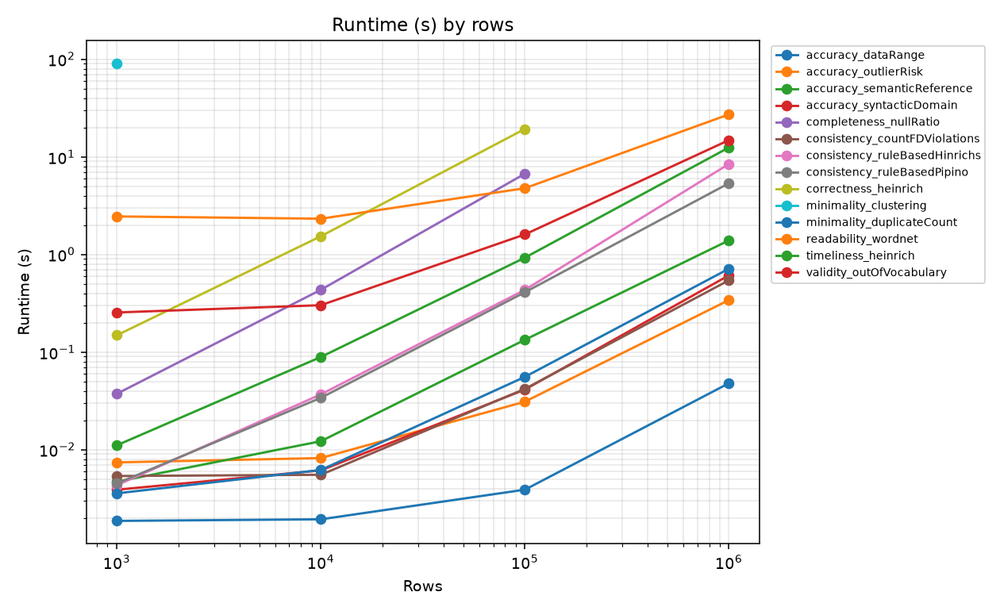
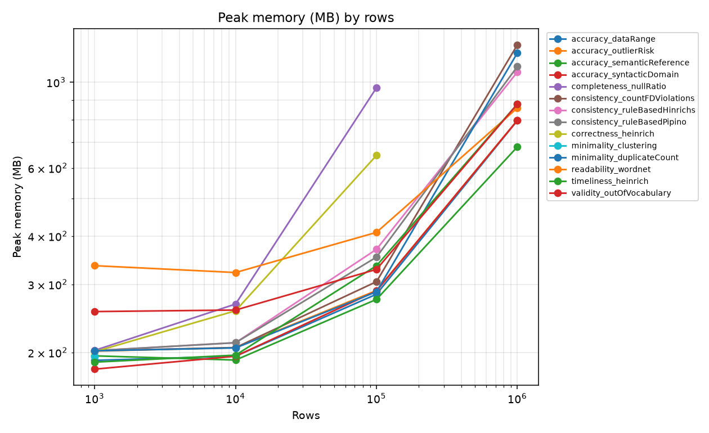
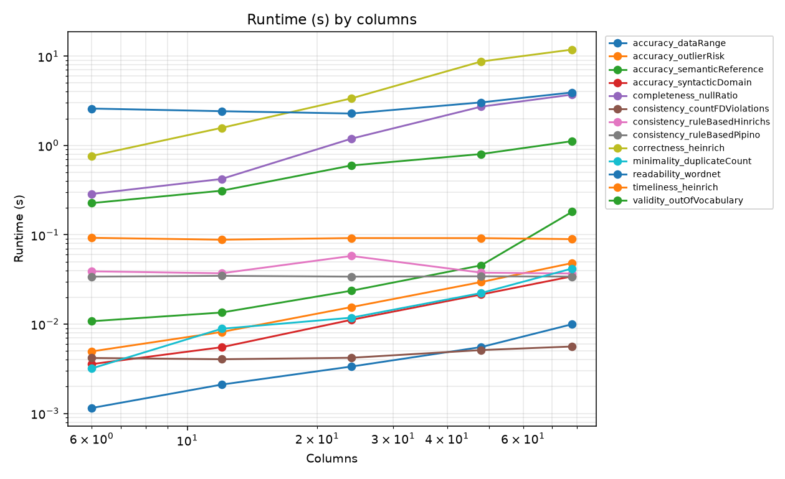
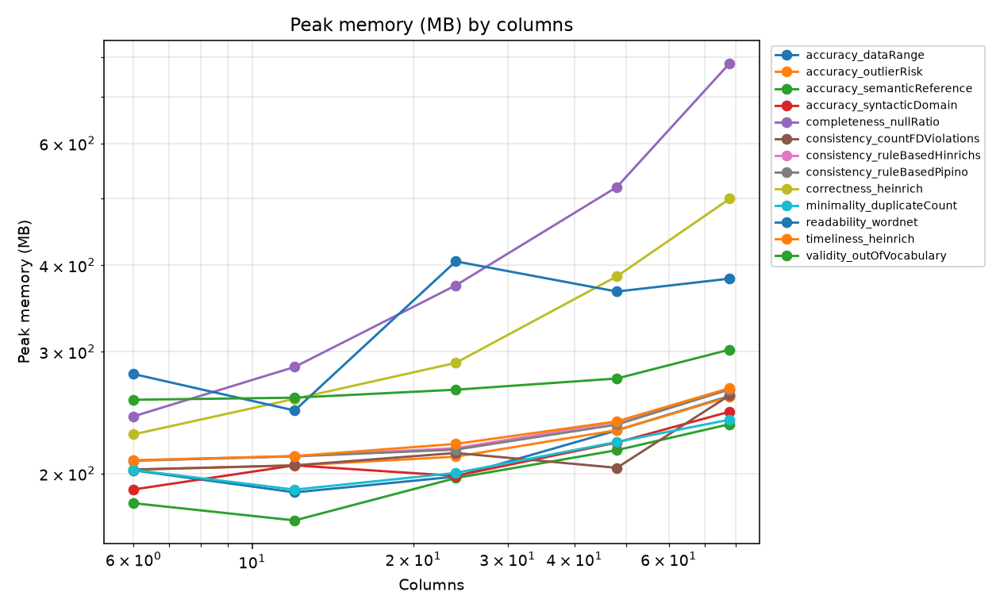

# Scalability benchmarks

## How it works

Each metric is being tested a ladder of input sizes. Row count is the primary axis, swept at 1k, 10k, 100k and 1M rows over a fixed 12 column frame. Column count is the secondary axis, swept from 6 to 78 columns over a fixed 10k rows.

Every measurement of one metric at one size runs in its own subprocess. That gives a clean peak memory figure, and an out-of-memory kill or a crash is recorded as a result instead of destroying the run. Each measurement ends with a status of `ok`, `timeout`, `memory` or `error`.

A metric stops climbing as soon as it breaches its budget. A metric that times out at 100k rows is not retried at a million. The headline output is therefore the largest input each metric survived.

Data is generated by a seeded synthetic generator with a repeating mix of integer, float, categorical, text, date and sparse columns. It includes nulls and duplicate rows so completeness and minimality metrics have something to measure.

The `generation_seconds` recorded for each measurement covers more than just building the frame. The timer starts before the frame is generated and stops after the metric's fixture is built (`benchmarks/measure.py`), so for any metric whose fixture does work beyond a default config, `generation_seconds` includes that work as well. Most fixtures are trivial and add nothing measurable, but `correctness_heinrich` is an exception to this, as seen below in the results.

## Running it

```bash
pip install -r requirements-dev.txt
python -m benchmarks.sweep --out benchmarks/results/sweep.csv
python -m benchmarks.plot --csv benchmarks/results/sweep.csv --outdir benchmarks/results
```

Useful flags:

- `--metric NAME` sweeps a single metric.
- `--timeout SECONDS` changes the per-measurement budget (default 120).
- `--axes rows` skips the column sweep.
- `--include-skipped` also sweeps the metrics excluded by default.

## Excluded by default

Two metrics are excluded unless `--include-skipped` is passed.

`readability_llm` loads a local HuggingFace language model, so its runtime measures model inference rather than Metis. It also needs the optional transformers dependency.

`completeness_nullAndDMVRatio` requires the FAHES native library, which is not built in every environment.

## Reading the memory numbers

`peak_mb` is the peak resident set size of the whole child process, not of the metric alone. It includes the Python interpreter, pandas, and the generated frame, and it sits at a floor of roughly 190 to 400 MB even for trivial work. `baseline_mb` is the same measurement taken immediately before the metric runs, right after the frame has been generated. The difference between the two is the closest this harness gets to the metric's own attributable memory cost.

That difference is frequently exactly zero. `ru_maxrss` is a high-water mark that never falls within a process, so if generating the frame already pushed the process to its peak, and the metric never exceeds that peak, the delta reads zero. A zero does not mean the measurement failed, it means the metric added no additional peak memory beyond the cost of the frame it was handed, which is itself a useful finding about that metric.

## Results

Measured on an Apple M1, 8 cores, 8 GB RAM, macOS (Darwin 25.5.0, arm64), Python 3.13.2, 2026-08-15.

The full sweep covers 14 metrics on both axes, 120 measurements in total. 116 finished `ok`, 4 hit the 120 second timeout, and 0 were killed for memory or crashed with an error. The table below is the row-axis ceiling for each metric, sorted the way `plot.limits_table` sorts it: largest surviving row count first, ties broken alphabetically.

| Metric                        | Max rows survived | Stopped by                | Slowest ok run (s) | Peak memory at that size (MB) |
| ----------------------------- | ----------------- | ------------------------- | ------------------ | ----------------------------- |
| accuracy_dataRange            | 1,000,000         | reached top of ladder     | 0.05               | 796                           |
| accuracy_outlierRisk          | 1,000,000         | reached top of ladder     | 0.34               | 797                           |
| accuracy_semanticReference    | 1,000,000         | reached top of ladder     | 1.40               | 681                           |
| accuracy_syntacticDomain      | 1,000,000         | reached top of ladder     | 0.61               | 797                           |
| consistency_countFDViolations | 1,000,000         | reached top of ladder     | 0.54               | 1250                          |
| consistency_ruleBasedHinrichs | 1,000,000         | reached top of ladder     | 8.47               | 1063                          |
| consistency_ruleBasedPipino   | 1,000,000         | reached top of ladder     | 5.37               | 1098                          |
| minimality_duplicateCount     | 1,000,000         | reached top of ladder     | 0.72               | 1190                          |
| readability_wordnet           | 1,000,000         | reached top of ladder     | 27.25              | 858                           |
| timeliness_heinrich           | 1,000,000         | reached top of ladder     | 12.49              | 878                           |
| validity_outOfVocabulary      | 1,000,000         | reached top of ladder     | 14.86              | 878                           |
| completeness_nullRatio        | 100,000           | timeout at 1,000,000 rows | 6.73               | 967                           |
| correctness_heinrich          | 100,000           | timeout at 1,000,000 rows | 19.34              | 647                           |
| minimality_clustering         | 1,000             | timeout at 10,000 rows    | 91.11              | 195                           |









## Findings

### minimality_clustering (hard ceiling)

- 91.11s at 1,000 rows, timeout at 10,000 rows (120s budget), on both the row sweep and the column sweep (fixed at 10,000 rows).
- Every other metric reaches at least 100,000 rows. 11 of 14 reach 1M.
- 91s to >120s for a 10x input increase is consistent with quadratic pairwise comparison, so the limit is structural.
- Generation at 10,000 rows is under 0.1s, so the timeout is not a harness artifact.
- Separately broken: the custom backend returns 1.0 regardless of input, verified against identical-row and fully-distinct-row frames.

### Cell-granularity metrics

`completeness_nullRatio` and `correctness_heinrich` reach 100,000 rows, time out at 1M.

- Both emit one result per cell, so `n_results` = rows x columns. At 100,000 rows and 12 columns that is 1.2M results for each.
- Growth per 10x rows: nullRatio 11.6x then 15.4x, heinrich 10.3x then 12.6x. Both super-linear, extrapolating past 120s at 1M.

### Super-linear but not timing out

- `consistency_ruleBasedHinrichs`: reaches 1M at 8.47s, growth 8.5x, 11.8x, 19.5x. Curve is bending upward, do not extrapolate linearly beyond 1M.
- `readability_wordnet`: slowest metric to reach 1M (27.25s), but growth is 0.95x, 2.05x, 5.7x, sub-linear at scale. Cause: generator vocabulary grows as sqrt(n) (`benchmarks/datagen.py`, `vocab_size = max(len(_WORDS), math.isqrt(n) + 1)`), a Heaps' law approximation. Distinct tokens measured: 31 at 1k, 301 at 100k, 949 at 1M, so new tokens per row falls from 0.031 to 0.00095. Per-token WordNet caching then raises hit rate. Real data with faster vocabulary growth will not show this.

### Memory

- `peak_mb` never falls below ~190 MB because it measures the whole child process, not the metric. Attributable cost is `peak_mb` minus `baseline_mb`.
- 36% of the 116 successful measurements show a delta under 0.5 MB. `ru_maxrss` is a high-water mark that never falls, so if frame generation set the peak, the delta reads zero. Applies at 1M to `accuracy_dataRange`, `accuracy_outlierRisk`, `accuracy_semanticReference`, `accuracy_syntacticDomain`, `consistency_ruleBasedPipino`, `minimality_duplicateCount`.
- Non-zero deltas: `completeness_nullRatio` +687 MB and `correctness_heinrich` +442 MB at 100k rows, both growing with column count. `consistency_ruleBasedHinrichs` +24 MB at 1M. `consistency_countFDViolations` +1.6 MB at 1M, near the noise floor.