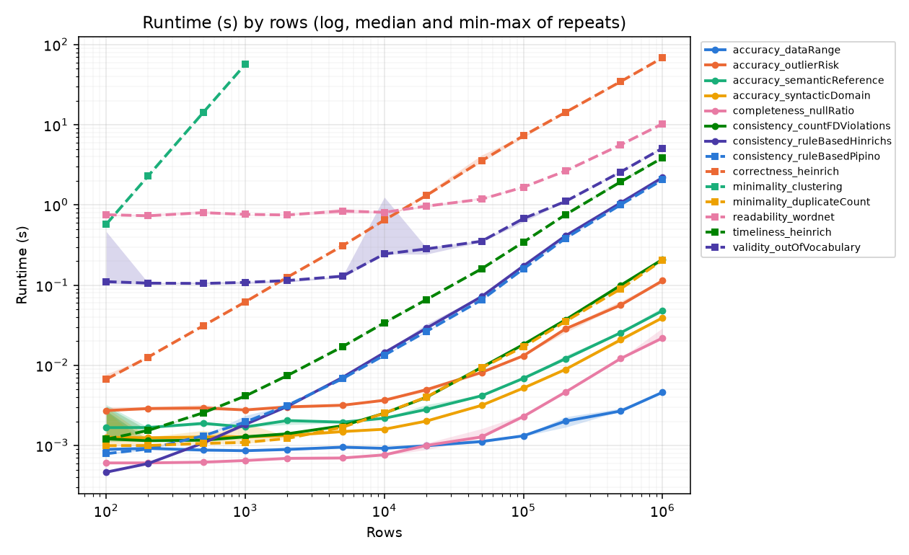
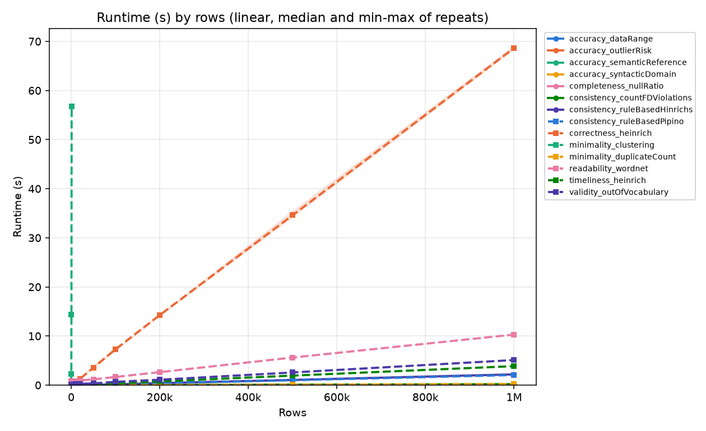
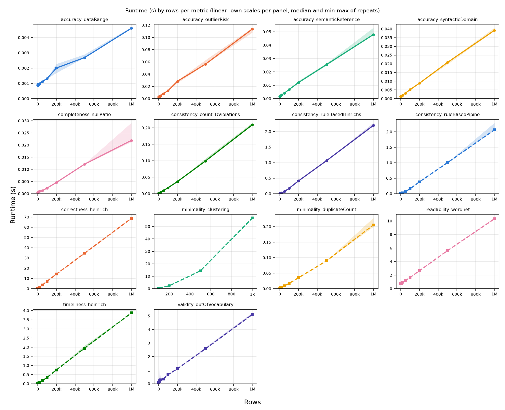
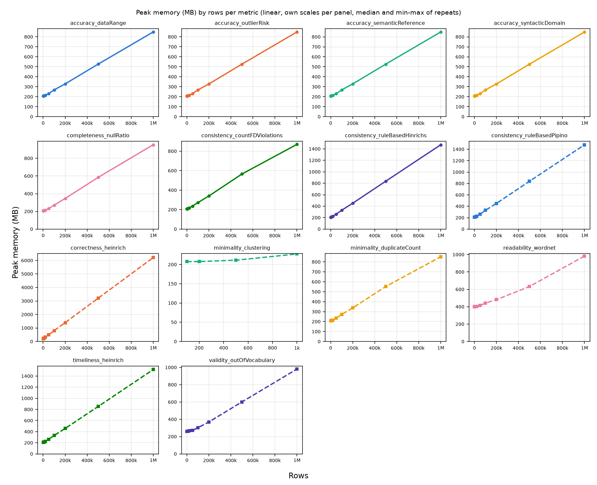
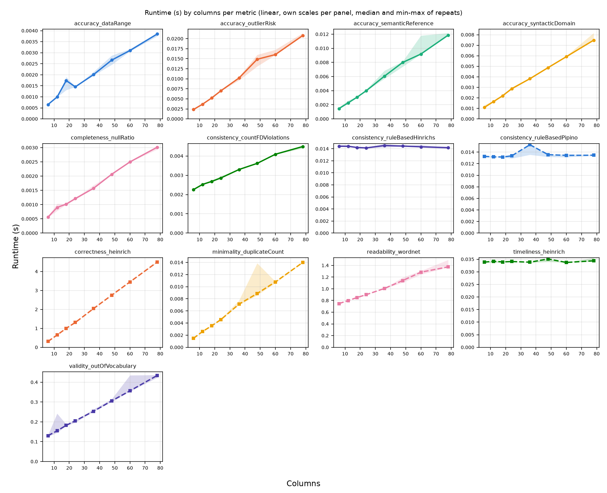

# Scalability benchmarks

## How it works

Each metric is tested on a ladder of input sizes. Row count is the primary axis, swept in 1-2-5 steps per decade from 100 to 1M rows (100, 200, 500, 1k, 2k, ... 1M) over a fixed 12 column frame. Column count is the secondary axis, swept at 6, 12, 18, 24, 36, 48, 60 and 78 columns over a fixed 10k rows. The ladder starts at 100 rows so that metrics with a low ceiling still get several points before they stop.

Every measurement of one metric at one size runs in its own subprocess. That gives a clean peak memory figure, and an out-of-memory kill or a crash is recorded as a result instead of destroying the run. Each measurement ends with a status of `ok`, `timeout`, `memory` or `error`.

Each point is measured three times, each in a fresh subprocess and with the same seed. Plots and tables report the median, with the min-max range as spread. A breach in any repeat counts as a breach of the point, and the remaining repeats are skipped.

A metric stops climbing as soon as it breaches its budget. A metric that times out at 100k rows is not retried at a million. The headline output is therefore the largest input each metric survived.

Data is generated by a seeded synthetic generator with a repeating mix of integer, float, categorical, text, date and sparse columns. It includes nulls and duplicate rows so completeness and minimality metrics have something to measure.

A point that survives all its repeats gets one extra, timed run. It splits the time spent in `assess()` into `result_seconds`, spent building `DQResult` objects (including the `pd.Timestamp.now()` call every metric makes per result), and `compute_seconds`, everything else.

The `generation_seconds` recorded for each measurement covers more than just building the frame. The timer starts before the frame is generated and stops after the metric's fixture is built (`benchmarks/measure.py`), so for any metric whose fixture does work beyond a default config, `generation_seconds` includes that work as well. Most fixtures are trivial and add nothing measurable, but `correctness_heinrich` is an exception to this, as seen below in the results.

## Running it

```bash
pip install -r requirements-dev.txt
python -m benchmarks.sweep --out benchmarks/results/sweep.csv
python -m benchmarks.plot --csv benchmarks/results/sweep.csv --outdir benchmarks/results
```

Useful flags:

- `--metric NAME` sweeps a single metric.
- `--timeout SECONDS` changes the per-measurement budget (default 120).
- `--axes rows` skips the column sweep.
- `--repeats N` changes how often each point is measured (default 3).
- `--include-skipped` also sweeps the metrics excluded by default.

The plot step writes 16 charts: runtime and peak memory, by rows and by columns, each as one shared chart and as one panel per metric, each in log-log and linear scale.

## Excluded by default

Two metrics are excluded unless `--include-skipped` is passed.

`readability_llm` loads a local HuggingFace language model, so its runtime measures model inference rather than Metis. It also needs the optional transformers dependency.

`completeness_nullAndDMVRatio` requires the FAHES native library, which is not built in every environment.

## Reading the memory numbers

`peak_mb` is the peak resident set size of the whole child process, not of the metric alone. It includes the Python interpreter, pandas, and the generated frame, and it sits at a floor of roughly 190 to 400 MB even for trivial work. `baseline_mb` is the same measurement taken immediately before the metric runs, right after the frame has been generated. The difference between the two is the closest this harness gets to the metric's own attributable memory cost.

That difference is frequently exactly zero. `ru_maxrss` is a high-water mark that never falls within a process, so if generating the frame already pushed the process to its peak, and the metric never exceeds that peak, the delta reads zero. A zero does not mean the measurement failed, it means the metric added no additional peak memory beyond the cost of the frame it was handed, which is itself a useful finding about that metric.

## Results

Measured on an Apple M5 Pro, 15 cores, 48 GB RAM, macOS (Darwin 27.0.0, arm64), Python 3.14.7, pandas 3.0.3, 2026-10-05. The previous sweep ran on an Apple M1 with 8 GB, Python 3.13 and pandas 2, so absolute numbers are not comparable with it.

The full sweep covers 14 metrics on both axes, 1,110 measurements in total: 833 plain runs and 277 timed runs. Of the plain runs, 831 finished `ok`, 2 hit the 120 second timeout, and 0 were killed for memory or crashed with an error.

The table below is the row-axis ceiling for each metric, sorted the way `plot.limits_table` sorts it: largest surviving row count first, ties broken alphabetically. The growth exponent k is fitted as runtime ~ rows^k over each metric's top decade of surviving sizes, so k = 1 is linear and k = 2 is quadratic. The result share is the fraction of `assess()` time spent building `DQResult` objects at the ceiling, from the timed run.

| Metric                        | Max rows survived | Stopped by            | Median runtime (s) | Peak memory at that size (MB) | Growth exponent k | Result share |
| ----------------------------- | ----------------- | --------------------- | ------------------ | ----------------------------- | ----------------- | ------------ |
| accuracy_dataRange            | 1,000,000         | reached top of ladder | 0.005              | 848                           | 0.52 ± 0.03       | 1%           |
| accuracy_outlierRisk          | 1,000,000         | reached top of ladder | 0.11               | 849                           | 0.91 ± 0.02       | 0%           |
| accuracy_semanticReference    | 1,000,000         | reached top of ladder | 0.05               | 849                           | 0.85 ± 0.02       | 0%           |
| accuracy_syntacticDomain      | 1,000,000         | reached top of ladder | 0.04               | 848                           | 0.88 ± 0.01       | 0%           |
| completeness_nullRatio        | 1,000,000         | reached top of ladder | 0.02               | 953                           | 1.02 ± 0.03       | 0%           |
| consistency_countFDViolations | 1,000,000         | reached top of ladder | 0.21               | 870                           | 1.07 ± 0.01       | 0%           |
| consistency_ruleBasedHinrichs | 1,000,000         | reached top of ladder | 2.20               | 1471                          | 1.10 ± 0.01       | 67%          |
| consistency_ruleBasedPipino   | 1,000,000         | reached top of ladder | 2.06               | 1479                          | 1.11 ± 0.02       | 72%          |
| correctness_heinrich          | 1,000,000         | reached top of ladder | 68.65              | 6211                          | 0.98 ± 0.01       | 24%          |
| minimality_duplicateCount     | 1,000,000         | reached top of ladder | 0.21               | 851                           | 1.08 ± 0.02       | 0%           |
| readability_wordnet           | 1,000,000         | reached top of ladder | 10.30              | 982                           | 0.80 ± 0.01       | 0%           |
| timeliness_heinrich           | 1,000,000         | reached top of ladder | 3.87               | 1517                          | 1.05 ± 0.01       | 40%          |
| validity_outOfVocabulary      | 1,000,000         | reached top of ladder | 5.11               | 981                           | 0.90 ± 0.02       | 0%           |
| minimality_clustering         | 1,000             | timeout at 2,000 rows | 56.80              | 227                           | 2.00 ± 0.003      | 0%           |











## Findings

### minimality_clustering (hard ceiling)

- 0.57s at 100 rows, 56.80s at 1,000 rows, timeout at 2,000 rows (120s budget). The column sweep (fixed at 10,000 rows) times out at the first step, 6 columns.
- Every other metric reaches 1M rows.
- 99x runtime for a 10x input increase, fitted k = 2.00 ± 0.003: exactly quadratic, consistent with pairwise row comparison, so the limit is structural.
- Generation at 1,000 rows is under 0.01s, so the timeout is not a harness artifact.
- Previously also broken: the custom backend returned 1.0 regardless of input, because numpy `int64` values are not Python `int`s and integer columns fell through to a similarity of 0. Identical rows then scored 0.83, below the 0.85 threshold, so no rows ever merged. Fixed in `metis/utils/similarity_measures/row.py`.

### Cell-granularity metrics

`correctness_heinrich` now reaches 1M rows, where it previously timed out. `completeness_nullRatio` reports per column by default and no longer emits one result per cell.

- `correctness_heinrich` emits one result per cell, so `n_results` = rows x columns, 12M at 1M rows. Growth per 10x rows: 10.5x, 11.3x, 9.4x, fitted k = 0.98, linear. Looking each column up once instead of once per cell made it ~3.6x faster with identical output.
- 24% of its runtime at 1M is spent building result objects, and its peak memory is 6.2 GB, almost all of it the 12M results.
- `completeness_nullRatio` per column takes 0.02s at 1M. Per cell (`aggregation_axis=None`) is still available, but is no longer measured here.

### Super-linear but not timing out

- `consistency_ruleBasedHinrichs` and `consistency_ruleBasedPipino`: reach 1M at 2.20s and 2.06s, k = 1.10 and 1.11, the only metrics slightly above linear. 67% and 72% of their runtime at 1M goes into building result objects.
- `readability_wordnet`: second slowest metric to reach 1M (10.30s), but growth is 1.01x, 1.06x, 2.06x, 6.18x, sub-linear at scale (k = 0.80). Cause: generator vocabulary grows as sqrt(n) (`benchmarks/datagen.py`, `vocab_size = max(len(_WORDS), math.isqrt(n) + 1)`), a Heaps' law approximation. Distinct tokens measured: 31 at 1k, 301 at 100k, 949 at 1M, so new tokens per row falls from 0.031 to 0.00095. Per-token WordNet caching then raises hit rate. Real data with faster vocabulary growth will not show this.

### Memory

- `peak_mb` never falls below ~200 MB because it measures the whole child process, not the metric. Attributable cost is `peak_mb` minus `baseline_mb`.
- 23% of the 831 successful plain measurements show a delta under 0.5 MB. `ru_maxrss` is a high-water mark that never falls, so if frame generation set the peak, the delta reads zero. Applies at 1M to `accuracy_dataRange`, `accuracy_outlierRisk`, `accuracy_semanticReference`, `accuracy_syntacticDomain`.
- Non-zero deltas at 1M: `correctness_heinrich` +5,206 MB (~450 bytes per cell result, doubling with each doubling of rows), `timeliness_heinrich` +669 MB, `consistency_ruleBasedPipino` +630 MB and `consistency_ruleBasedHinrichs` +623 MB, all from their one result per row. `readability_wordnet` +134 MB, `validity_outOfVocabulary` +133 MB, `completeness_nullRatio` +105 MB, `consistency_countFDViolations` +21 MB. `minimality_duplicateCount` +2.9 MB, near the noise floor.
