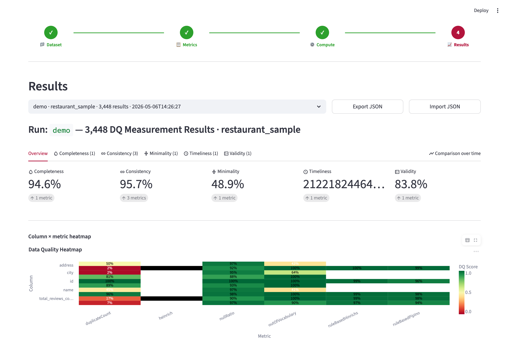

# The Metis GUI

The Metis GUI is a Streamlit app that runs a full data quality assessment
without writing any code. It walks through four steps: load a dataset,
select and configure metrics, compute, and explore the results visually.
Results are persisted locally, so earlier runs can be reopened and compared over time.



## Quick start

```
pip install -r requirements.txt -r gui/requirements.txt
streamlit run gui/app.py
```

The app opens with two tabs:

- **Demo**: a bundled restaurants sample with precomputed results, so you can explore the GUI without any setup or wait time.
- **Own Files**: upload your own CSV and run real assessments.

Set `METIS_DEMO_ONLY=1` (or `true` or `yes`) to start the app in demo-only
mode, which skips the Own Files flow entirely:

```
METIS_DEMO_ONLY=1 streamlit run gui/app.py
```

The theme is configured in `.streamlit/config.toml`.

## Desktop and browser mode

The same code runs in two environments. The app detects the environment at
startup by checking for Pyodide (`gui/app.py`).

| Mode    | Environment                  | Result storage                                  |
|---------|------------------------------|--------------------------------------------------|
| Desktop | `streamlit run gui/app.py`   | SQLite database (`SQLiteResultStore`)            |
| Browser | stlite (Pyodide, no install) | JSON files in the virtual FS (`JSONResultStore`) |

In desktop mode the Demo and Own Files flows are shown as two tabs side by
side. In browser mode a landing page asks the user to pick one of the two
flows first.

## The four-step wizard

A step indicator at the top of the page shows progress. The Back and Next
buttons navigate between steps. A step only becomes accessible once its
prerequisites are met, for example Compute stays locked until at least one
metric is selected and no blockers remain.

### Step 1: Dataset

`gui/ui/pages/dataset_page.py`

- Upload a CSV file. UTF-8 is tried first with a latin-1 fallback.
- Optionally upload a reference CSV. Reference-based metrics such as
  `correctness_heinrich` and `accuracy_semanticReference` need one and stay
  blocked without it.
- Set a dataset name and an optional table name. Each run gets an
  experiment tag, auto-generated as `{dataset_name}_{timestamp}`.
- A preview shows the first 50 rows together with column types and basic
  statistics.
- The four most recent runs are listed with quick-open buttons that jump
  straight to their results.

### Step 2: Metrics

`gui/ui/pages/metrics_page.py`

- All registered metrics are listed in tabs grouped by dimension, with a
  search box and filter pills (All, No config, Needs config, Python rules,
  FD rules).
- Each metric card shows its description, configuration state and any
  availability warnings. Metrics whose native dependencies are missing (for
  example FAHES for `completeness_nullAndDMVRatio`) are disabled with a
  warning.
- Metrics are configured inline through the appropriate editor, chosen by the
  metric's metadata (see the config conventions in the
  [README](../README.md#config-conventions)):
  - a form editor for plain dataclass configs
  - a Python editor for callable rule configs (`consistency_ruleBased*`)
  - an inline rule editor for functional dependencies
    (`consistency_countFDViolations`)
  - `timeliness_heinrich` gets a dedicated per-column editor
  - `diversity_coverageGap` gets a dedicated MUP-file uploader and positional
    dataset-attribute mapping; its `mincov` is inferred from filenames such as
    `*_mincov_19000.txt` when available
- Select all and deselect buttons exist per dimension. The page lists
  blockers (missing required configs, missing reference dataset) before
  letting you continue.

### Step 3: Compute

`gui/ui/pages/compute_page.py`

- Runs the selected metrics one after another with a progress bar.
- Errors are isolated per metric. One failing metric does not stop the
  others, and failures are reported next to the successful results.
- Metrics that can emit per-cell results respect a row cap to keep result
  volumes manageable. A warning appears when the cap would truncate
  results.
- Results and run metadata (experiment tag, dataset name, table name) are
  saved to the active result store.

### Step 4: Results

`gui/ui/pages/results_page.py`

- A run selector lists all stored experiments. Runs can be exported to JSON
  and imported back, which also makes results portable between desktop and
  browser mode.
- Results are grouped in tabs by dimension. Each metric is rendered by a
  visualization picked from its granularity:
  - column and cell results become per-column bar charts
  - row results become histograms, or pass/fail summaries when the values
    are binary
  - table results become KPI cards, or a violations-per-rule chart for
    functional dependencies
- A heatmap compares all column-level metrics across all columns at once.
- Worst-results tables list the lowest scoring rows and columns per metric
  and across metrics.
- When several runs exist for the same dataset, a comparison-over-time
  chart plots the mean score per metric across runs.

## Demo mode

Demo mode allows you to explore the GUI without needing to upload your own dataset, thinking about how to configure each metric and waiting for the metrics to compute. It is also what runs in the
browser deployment, where heavy metrics would be slow.

The bundled demo dataset is `gui/demo/restaurant_sample.csv`, a 288-row
slice of `data/restaurants.csv` (the framework demo dataset described in
the [README](../README.md#the-demo-dataset)) with the same mix of
near-duplicate rows, nulls and rule violations.

Precomputed results for seven metrics live in `gui/demo/precomputed/`:

| File                        | Experiment tag    | Purpose                                |
|-----------------------------|-------------------|----------------------------------------|
| `restaurant_results.json`   | `demo`            | Current snapshot, no extra noise       |
| `restaurant_results_t2.json`| `demo-2026-03-22` | Backdated snapshot with moderate noise |
| `restaurant_results_t1.json`| `demo-2026-03-08` | Backdated snapshot with even more noise    |

All three snapshots share the dataset name `restaurant_sample`, so the
results page groups them into one time series. The temporal chart then
shows data quality improving over time, which is the intended demo
narrative.

The seven demo metrics are `completeness_nullRatio`,
`minimality_duplicateCount`, `validity_outOfVocabulary`,
`consistency_countFDViolations`, `consistency_ruleBasedHinrichs`,
`consistency_ruleBasedPipino` and `timeliness_heinrich`. Their
configurations are fixed and shown read-only in the Metrics step. They are
defined in `gui/demo/demo_metric_configs.py`, with the Python rule files
for the two rule-based consistency metrics living in
`data/restaurants_consistency_ruleBasedHinrichs.py` and
`data/restaurants_consistency_ruleBasedPipino.py`.

On startup the app seeds every `gui/demo/precomputed/restaurant_results*.json`
file into the result store, skipping tags that already exist.

## Maintainer scripts

Three scripts in `gui/scripts/` build and refresh the demo artifacts. They
are not needed to use the GUI.

### `build_demo_dataset.py`

Builds `data/restaurants.csv` from the clean source
`data/restaurants_source.csv` by appending four synthetic columns and
injecting seeded noise. See the
[README](../README.md#the-demo-dataset) for the column distributions and
noise rates.

```
python gui/scripts/build_demo_dataset.py \
    --source data/restaurants_source.csv \
    --output data/restaurants.csv
```

### `run_demo_pipeline.py`

Precomputes metric results on a dataset and writes them to a JSON file in
the GUI's import format. Metrics whose source code and input data have not
changed since the last run are skipped (hash-based selective
recomputation).

```
python gui/scripts/run_demo_pipeline.py \
    --dataset gui/demo/restaurant_sample.csv \
    --metrics completeness_nullRatio,minimality_duplicateCount \
    --output gui/demo/precomputed/restaurant_results.json
```

Use `--merge-into <file>` to add metrics to an existing result file and
`--max-rows <n>` to cap the input size.

### `build_temporal_demo.py`

Generates the two backdated snapshots for the comparison-over-time chart.
It slices rows 288 to 576 and 576 to 864 out of `data/restaurants.csv`,
degrades them with extra nulls and duplicate rows (20%/5% for t1, 10%/2%
for t2), runs all demo metrics on each slice, and writes the backdated
JSON snapshots plus the sliced CSVs into `gui/demo/`.

```
python gui/scripts/build_temporal_demo.py
```

## Architecture

```
gui/
├── app.py            entry point, wizard routing, demo seeding
├── theme.py          HPI brand colors
├── core/             framework-facing logic, no Streamlit imports
├── ui/               Streamlit pages and widgets
├── visualization/    result rendering (Altair charts)
├── demo/             demo dataset, configs and precomputed results
└── scripts/          maintainer scripts (see above)
```

### `gui/core/`

| Module              | Purpose                                                                 |
|---------------------|--------------------------------------------------------------------------|
| `metric_catalog.py` | Introspects `Metric.registry` into `MetricInfo` objects (config class, required fields, `_gui_*` metadata) and computes compute blockers. Also home of `_NATIVE_LIB_CHECKS` for native dependencies. |
| `metric_runner.py`  | Executes the selected metrics with per-metric error isolation            |
| `result_store.py`   | Persistence behind the GUI. `SQLiteResultStore` for desktop, `JSONResultStore` for the browser. Serves pre-aggregated queries for the results page. |
| `serialization.py`  | Converts `DQResult` objects to and from JSON-safe dicts                  |

### `gui/ui/`

The four wizard pages (`ui/pages/`), the config editors
(`ui/components/config_editors/`), dimension icons (`ui/icons.py`) and
`ui/state.py`, a typed wrapper around Streamlit session state that keeps
the Demo and Own Files wizards isolated from each other.

### `gui/visualization/`

`dispatch.py` routes each metric to a renderer based on granularity and on
signals extracted from the stored results (`signals.py`), for example
"values are binary" or "explanations carry FD rule keys". The renderers in
`renderers/` produce the Altair charts described in
[Step 4](#step-4-results). All renderers read pre-aggregated data from the
result store rather than raw results, which keeps the page fast for large
runs.

## Making a new metric show up correctly

The GUI discovers metrics automatically through `Metric.registry`. A new
metric appears in the Metrics step without any GUI changes, as long as it
follows the config conventions documented in the
[README](../README.md#config-conventions). The `_gui_*` class attributes
control its description, badges, editor type and renderer choice.
